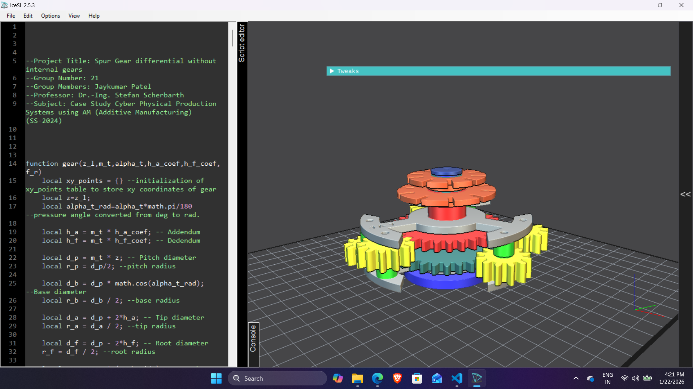
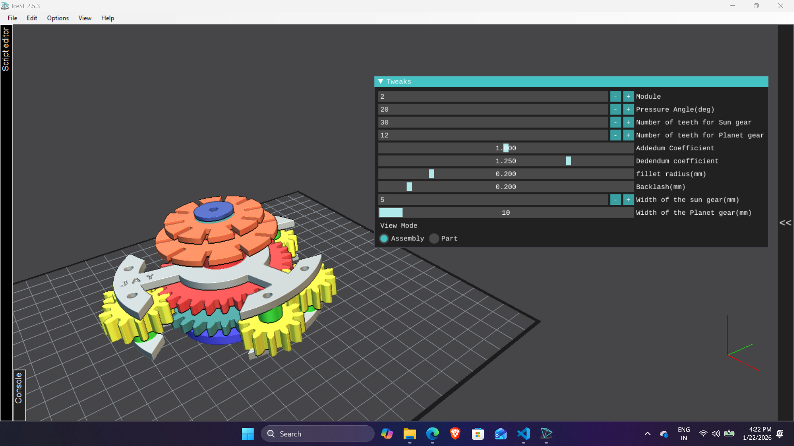
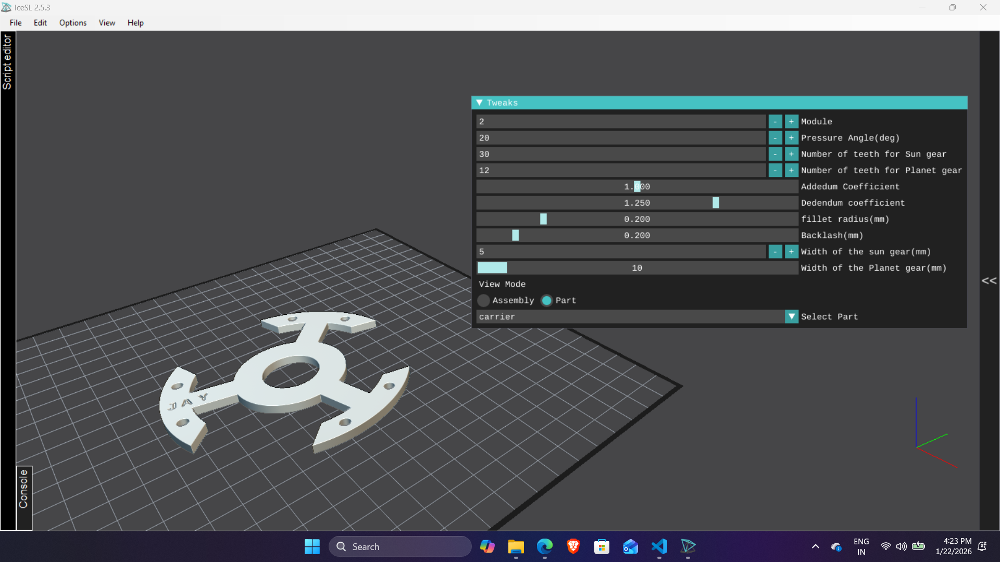
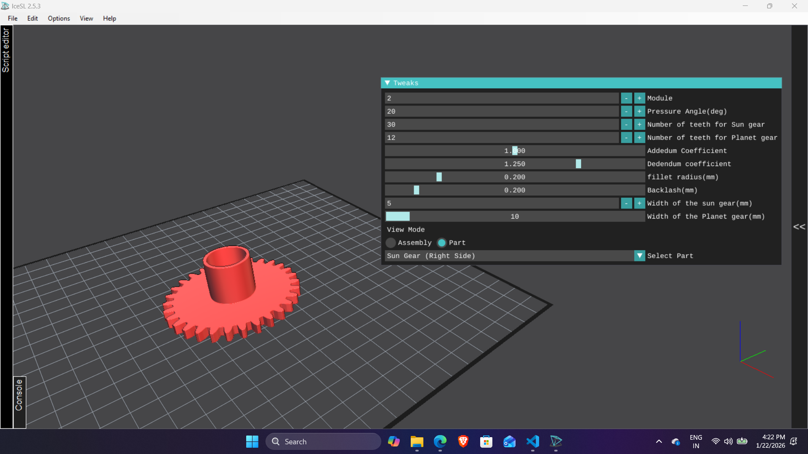
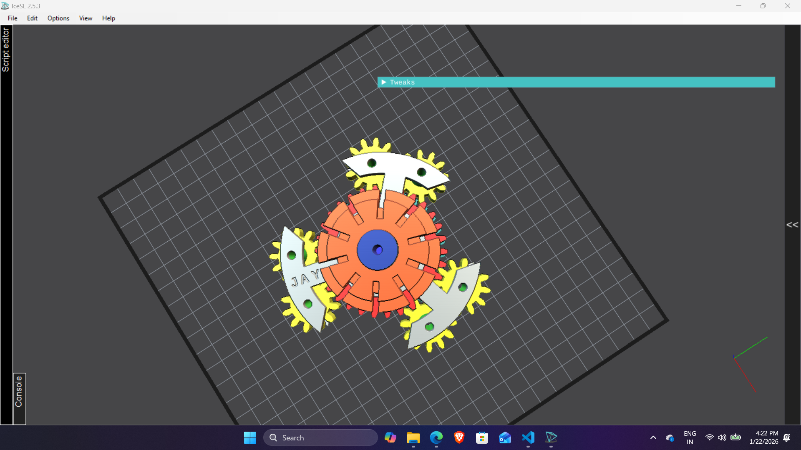

# Involute-spur-gear-differential-without-internal-gears

## IceSL Lua – Additive Manufacturing Case Study

This repository contains a **fully parametric spur-gear differential without internal (ring) gearing**, modeled and generated using **IceSL with Lua scripting**.  
The project was developed as part of an **Additive Manufacturing (AM) case study**, focusing on procedural CAD, gear theory, and print-oriented mechanical design.

Unlike conventional differentials that rely on an internal ring gear, this design achieves differential action using **only external spur gears** arranged in a planetary configuration.

---

## Project Information

- **Project Title:** Spur Gear Differential Without Internal Gears  
- **Group Number:** 21  
- **Group Members:**  
  - Jaykumar Patel 
- **Professor:** Dr.-Ing. Stefan Scherbarth  
- **Course:** Case Study – Cyber Physical Production Systems using Additive Manufacturing  
- **Semester:** SS 2024  

---

## Overview

The IceSL Lua script generates a **complete differential gearbox assembly**, including:

- Left and right **sun gears**
- Three **planet gears** per side
- **Planet shafts**
- Dual **carriers**
- Output **wheels**
- Central **shaft**
- **Mounting plate** and **end plate**

All components are **procedurally generated**, **fully parametric**, and can be visualized as an assembly or exported individually for **3D printing**.

---

## Key Features

- Fully procedural **involute spur gear generation**
- Differential mechanism using **only external gears**
- Parametric control via **IceSL UI elements**
- Two visualization modes:
  - **Assembly Mode**
  - **Individual Part Mode**
- Gear backlash, fillets, and tolerances suitable for AM
- Automatic meshing constraints for sun–planet gear sets
- Designed specifically for **Additive Manufacturing workflows**

---

## Requirements

- **IceSL** (https://icesl.loria.fr/)
- Lua scripting enabled
- Basic knowledge of spur gear theory and AM processes

---

## User Interface Controls

All key parameters can be modified directly inside IceSL.

### Gear Parameters
- Module
- Pressure angle (degrees)
- Number of teeth (sun gear)
- Number of teeth (planet gear)
- Addendum coefficient
- Dedendum coefficient
- Backlash
- Root fillet radius

⚠️ **Important Constraint:**  
The number of teeth on the **sun gear must be a multiple of 3**.  
If this condition is violated, proper meshing of the planet gears is not possible.

---

### Geometry & Assembly Parameters

- Sun gear width
- Planet gear width
- Shaft diameters
- Carrier thickness
- Spacing between sun gears
- Clearances and tolerances for free rotation
- Screw and bore diameters

---

## View Modes

### Assembly Mode
Displays the **fully assembled differential**, including:
- Sun gears
- Planet gears
- Planet shafts
- Carriers
- Wheels
- Central shaft
- Mounting and end plates

This mode is intended for visualization, validation, and presentation.

---

### Part Mode
Allows selection and export of **individual components** for additive manufacturing:

1. Sun Gear (Right Side)  
2. Sun Gear (Left Side)  
3. Planet Gear  
4. Planet Shaft  
5. Carrier  
6. Wheel (Right Side)  
7. Wheel (Left Side)  
8. Mounting Plate with Shaft  
9. End Plate  

Each part can be exported as STL or directly converted to G-code.

---

## Technical Description

### Gear Geometry
- Standard **involute spur gear profiles**
- True involute diameter (TIF) calculation
- Root fillets for stress reduction
- Angular backlash compensation
- Accurate tooth thickness calculation at pitch and involute circles

### Differential Principle
- Two opposing sun gears
- Planet gears arranged at 120° intervals
- Independent carriers enable relative motion
- Differential action achieved **without any internal ring gear**

---

## Additive Manufacturing Considerations

- Backlash and clearances included for FDM printing
- Filleted tooth roots reduce stress concentrations
- Shaft and bore tolerances account for real-world printing inaccuracies
- Parts designed to be printable individually without complex supports

---

## Usage Instructions

1. Open **IceSL**
2. Load the script: Open `src/main.lua`
3. Adjust parameters using the UI
4. Select:
- **Assembly Mode** for full visualization  
- **Part Mode** for individual components
5. Export STL or generate G-code as required

---

## Limitations

- This is a **geometric and kinematic model**
- No bearing elements included
- No load, fatigue, or stress validation
- Not intended for high-speed or high-torque applications without further engineering analysis

---

## Possible Extensions

- Add bearing seats and fasteners
- Perform FEM-based stress analysis
- Optimize geometry for specific AM processes (FDM, SLA, SLS)
- Add animation for dynamic demonstration
- Integrate a closed housing for a complete gearbox

---

## License

This project is intended for **academic and educational use**.  
Reuse and modification are permitted with appropriate attribution.

---

## Acknowledgements

Developed using **IceSL** for procedural CAD modeling and additive manufacturing design.

## Images

